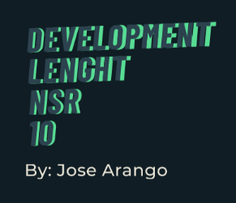
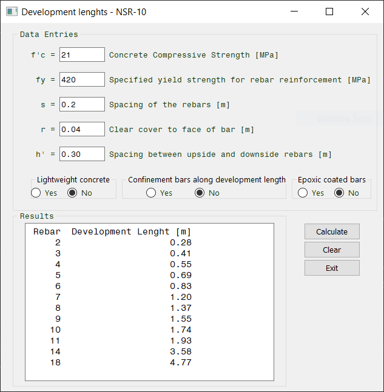
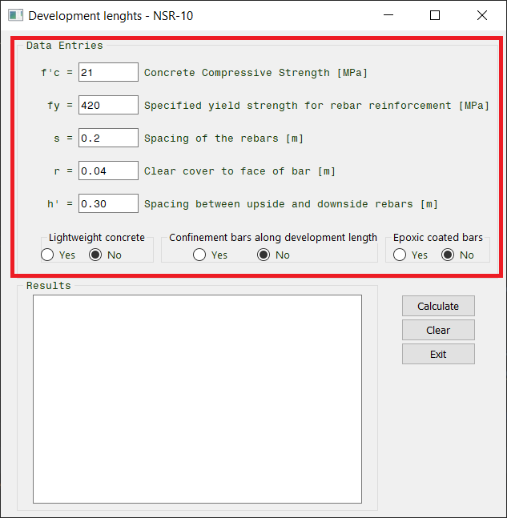
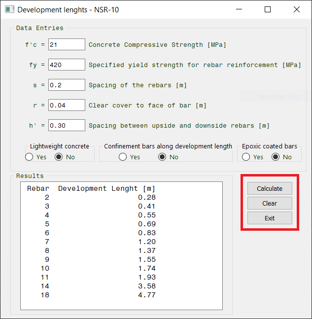

<!--
*** Thanks for checking out the Best-README-Template. If you have a suggestion
*** that would make this better, please fork the repo and create a pull request
*** or simply open an issue with the tag "enhancement".
*** Thanks again! Now go create something AMAZING! :D
***
***
***
*** To avoid retyping too much info. Do a search and replace for the following:
*** josearangoj, Development_lenght_NSR_10, twitter_handle, ingjdaj@gmail.com, Development Lenght NSR-10, Calculate the development Lenght for each rebar based on the reglament NSR-10 from Colombia, using a GUI.

-->

<!-- PROJECT SHIELDS -->

<!--
*** I'm using markdown "reference style" links for readability.
*** Reference links are enclosed in brackets [ ] instead of parentheses ( ).
*** See the bottom of this document for the declaration of the reference variables
*** for contributors-url, forks-url, etc. This is an optional, concise syntax you may use.
*** https://www.markdownguide.org/basic-syntax/#reference-style-links
-->

[![LinkedIn][linkedin-shield]][linkedin-url]

<!-- PROJECT LOGO -->
<br />
<p align="center">
  <a href="https://github.com/othneildrew/Best-README-Template">
    
  </a>

  <h3 align="center">Development Lenght NSR-10</h3>

  <p align="center">
    Calculate the development Lenght for each rebar based on the reglament NSR-10 from Colombia, using a GUI.
    <br />
    <a href="https://github.com/othneildrew/Best-README-Template"><strong>Explore the docs »</strong></a>
    <br />
    <br />
    <a href="https://github.com/othneildrew/Best-README-Template">View Demo</a>
    ·
    <a href="https://github.com/othneildrew/Best-README-Template/issues">Report Bug</a>
    ·
    <a href="https://github.com/othneildrew/Best-README-Template/issues">Request Feature</a>
  </p>
</p>

<!-- TABLE OF CONTENTS -->

<details open="open">
  <summary><h2 style="display: inline-block">Table of Contents</h2></summary>
  <ol>
    <li>
      <a href="#about-the-project">About The Project</a>
      <ul>
        <li><a href="#built-with">Built With</a></li>
      </ul>
    </li>
    <li>
      <a href="#getting-started">Getting Started</a>
      <ul>
        <li><a href="#prerequisites">Prerequisites</a></li>
        <li><a href="#installation">Installation</a></li>
      </ul>
    </li>
    <li><a href="#usage">Usage</a></li>
    <li><a href="#contact">Contact</a></li>
  </ol>
</details>

<!-- ABOUT THE PROJECT -->

## About The Project

This is the principal window, when the user can get the development lenght of all the rebar numbers.

  

### Built With

- conda
- python>=3.7
- pip
- qt=5.9
- pyqt=5.9
- numpy
- matplotlib
- math
- pandas

<!-- GETTING STARTED -->

## Getting Started

To get a local copy up and running follow these simple steps.

### Prerequisites

I suggest to install anaconda package. You can download for free in: [Anaconda | Individual Edition](https://www.anaconda.com/products/individual)

### Installation

1. Clone the repo on a local folder
   
   ```sh
   git clone https://github.com/josearangoj/Development_lenght_NSR_10.git
   ```

2. Install packages and create an enviroment using **.yml** file. You may write this on **anaconda prompt**
   
   ```sh
   conda env -f create install_dependences.yml
   ```

<!-- USAGE EXAMPLES -->

## Usage

1. Execute the file **main_gui.py** 

2. On the principal window, fill the required information:
   
   

3. On the principal window, fill the required information: [

<!-- CONTACT -->

## Contact

Jose David Arango - ingjdaj@gmail.com

Project Link: [https://github.com/josearangoj/Development_lenght_NSR_10](https://github.com/josearangoj/Development_lenght_NSR_10)

<!-- MARKDOWN LINKS & IMAGES -->

<!-- https://www.markdownguide.org/basic-syntax/#reference-style-links -->

[contributors-shield]: https://img.shields.io/github/contributors/josearangoj/repo.svg?style=for-the-badge
[contributors-url]: https://github.com/josearangoj/repo/graphs/contributors
[forks-shield]: https://img.shields.io/github/forks/josearangoj/repo.svg?style=for-the-badge
[forks-url]: https://github.com/josearangoj/repo/network/members
[stars-shield]: https://img.shields.io/github/stars/josearangoj/repo.svg?style=for-the-badge
[stars-url]: https://github.com/josearangoj/repo/stargazers
[issues-shield]: https://img.shields.io/github/issues/josearangoj/repo.svg?style=for-the-badge
[issues-url]: https://github.com/josearangoj/repo/issues
[license-shield]: https://img.shields.io/github/license/josearangoj/repo.svg?style=for-the-badge
[license-url]: https://github.com/josearangoj/repo/blob/master/LICENSE.txt
[linkedin-shield]: https://img.shields.io/badge/-LinkedIn-black.svg?style=for-the-badge&logo=linkedin&colorB=555
[linkedin-url]: https://linkedin.com/in/josearangoj
